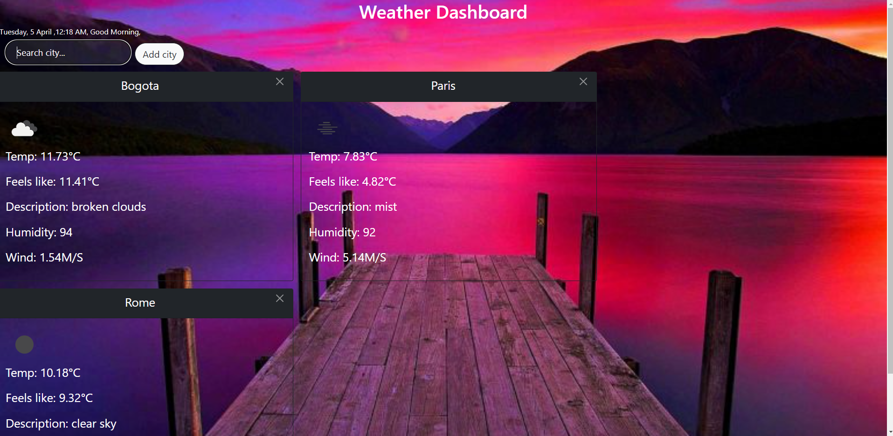
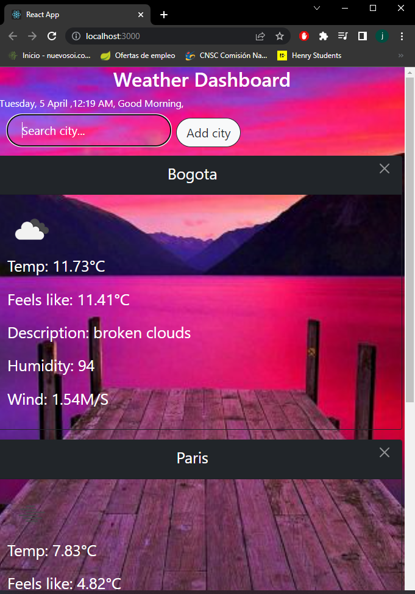

Hi, this is more advanced weather app, it uses react, html, css, javascript and bootstrap, in this case we used bootsrap to give style and components, and we are able to create multiple weather cards at the same time instead of only one, as an extra I added a way to look at the local time based on the locale, and using the bootstrap classes if the viewport becomes too small the cards adjust to only show one.

